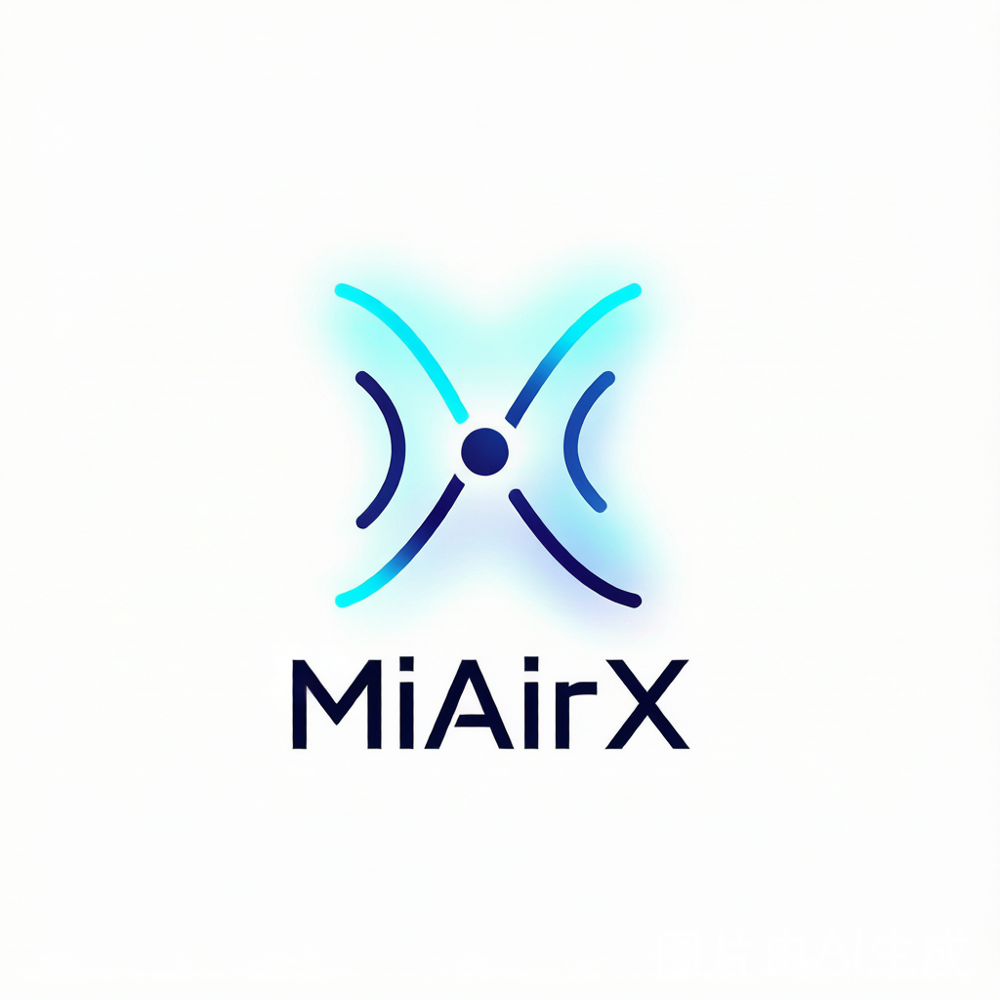
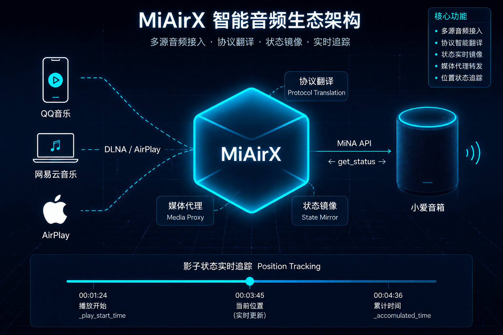

<p align="center">
  
</p>

<h1 align="center">MiAirX</h1>

<p align="center">
  
  
  
  
</p>

<p align="center">
  <b>让 QQ音乐 · 网易云音乐 · iOS 直接投送到你的小爱音箱</b><br>
  不改固件、不改 App，纯协议翻译。
</p>

<p align="center">
  <a href="#-快速开始">快速开始</a> ·
  <a href="#-原理">原理</a> ·
  <a href="#-web-管理界面">Web界面</a> ·
  <a href="#-docker">Docker</a> ·
  <a href="docs/ARCHITECTURE.md">架构详解</a> ·
  <a href="docs/SIMPLE.md">大白话版</a>
</p>

---

## 🎯 解决的痛点

买了小爱音箱，想用 QQ 音乐、网易云音乐的"投屏"功能，但死活搜不到你的音箱。

**因为小爱音箱说"小米语"（MiNA API），音乐 App 说"通用语"（DLNA），双方互不认识。**

MiAirX 在你电脑上扮演一个翻译官：

```
QQ音乐 ──DLNA──▶  MiAirX  ──MiNA API──▶  小爱音箱
```

| 不用 MiAirX | 用了 MiAirX |
|---|---|
| 投屏列表空空如也 | 你的音箱出现在列表中 |
| 只能对着音箱喊"小爱同学" | 手机选歌 → 点投屏 → 音箱出声 |

---

## 🏗️ 原理

<p align="center">
  
</p>

| 阶段 | 客户端行为 | MiAirX 行为 |
|------|------------|------------|
| ① **发现** | "附近有音箱吗？"（M-SEARCH 组播） | "有！小爱音箱在这里"（SSDP 响应） |
| ② **投送** | "播这首歌，链接是 xxx"（SOAP） | 下载音频 → 生成局域网链接 → 调 MiNA API 让音箱播放 |
| ③ **追踪** | "播到第几秒了？"（GetPositionInfo） | 内部精确跟踪位置，不被小米云 API 误导 |

> 完整技术细节见 [ARCHITECTURE.md](docs/ARCHITECTURE.md)，通俗版见 [SIMPLE.md](docs/SIMPLE.md)

---

## 🚀 快速开始

### 三种安装方式

#### 方式一：Docker（仅 Linux）

```bash
mkdir -p conf
docker run -d --name miairx \
  --network host \
  -e MI_USER=你的小米账号 \
  -e MI_PASS=你的密码 \
  -v $(pwd)/conf:/app/conf \
  ghcr.io/pdsb001/miairx:master
```

> Windows/macOS 不建议用 Docker（组播不通），请用方式二或三。

#### 方式二：pip 安装

```bash
pip install aiohttp miservice-fork zeroconf pycryptodome structlog pydantic pydantic-settings
python -m miairx
```

#### 方式三：源码安装

```bash
git clone https://github.com/PDSB001/MiAirX.git
cd MiAirX
pip install -e .
python start.py
```

---

### 无配置启动（零门槛）

**不需要写任何配置文件**。直接运行：

```bash
python start.py    # 或者 start.bat
```

第一次启动会自动弹出 Web 界面引导你输入小米账号密码，之后一切就绪。

```json
// conf/config.json — 自动生成的默认配置，不用改
{
  "account":  "",
  "password": "",
  "mi_did":   "",
  "hostname": ""
}
```

流程：`启动 → 浏览器打开 http://localhost:8300 → 设置页填账号密码 → 设备管理选音箱 → 保存重启 → 投！`

---

### 配置（可选）

如果你喜欢手动配，编辑 `conf/config.json`：

```json
{
  "account":  "你的小米账号",
  "password": "你的密码",
  "mi_did":   "音箱的DID",
  "hostname": "192.168.x.x"
}
```

| 字段 | 必填 | 说明 |
|------|------|------|
| `account` | ✅ | 小米账号（手机号/邮箱） |
| `password` | ✅ | 小米密码 |
| `mi_did` | ❌ | 音箱设备 ID，**可以不填，去 Web 界面选** |
| `hostname` | ❌ | 电脑 LAN IP，**留空自动检测** |

---

### 启动

```bash
# Windows 一键
start.bat

# Python 一键
python start.py

# 模块模式（推荐调试用）
python -m miairx --debug
```

启动成功后会看到：

```
INFO  MiAirX v1.0.0
INFO  Hostname: 192.168.1.172
INFO  DLNA  HTTP server on :8200
INFO  Web  management on :8300
INFO  Speakers registered: 小爱音箱Play增强版 (L05C)
```

---

### 投！

#### 📱 QQ 音乐

1. 选歌 → 播放界面右上角 ··· → 投屏
2. 点 **XiaoAI L05C**
3. 音箱出声

#### 🎵 网易云音乐

1. 选歌 → 播放界面 → 分享 → 投屏到设备
2. 选 **XiaoAI L05C**
3. 音箱出声

#### 🍎 iOS

1. 控制中心 → 隔空播放
2. 选 **XiaoAI L05C**
3. 任意 App 音频都会路由到音箱

> 💡 设备名格式：`XiaoAI L05C (663160981)`（硬件型号 + DID）

---

## 🎛️ Web 管理界面

启动后访问 **http://localhost:8300**

| 标签 | 功能 |
|------|------|
| 状态 | 服务运行状态、网络信息、音箱在线 |
| 媒体控制 | 播放/暂停/停止、音量、进度跳转 |
| 设备管理 | 已发现音箱、启用/禁用、复制 DID |
| 设置 | 配置修改、重启服务 |

---

## 🗂️ 项目结构

```
MiAirX/
├── start.py / start.bat       # 启动入口
├── docker-compose.yml         # Docker 编排
├── Dockerfile
├── conf/config.json           # 配置文件
├── src/miairx/
│   ├── cli.py                 # CLI
│   ├── app.py                 # 核心编排
│   ├── const.py               # DLNA 常量
│   ├── auth/                  # 小米账号认证
│   ├── config/                # 配置管理
│   ├── core/                  # 基础设施
│   ├── media/                 # 音频代理 & 转码
│   ├── speaker/               # 音箱控制
│   ├── protocols/
│   │   ├── dlna/              # DLNA/UPnP
│   │   └── airplay/           # AirPlay
│   └── web/                   # Web 管理 UI
└── tests/
```

---

## 🐳 Docker

> ⚠️ DLNA 依赖 UDP 组播，**网桥下客户端搜不到设备**。Docker 仅限 Linux + `--network host`。

**docker-compose（推荐）**

编辑 `docker-compose.yml` 填入账号密码，然后：

```bash
mkdir -p conf
docker compose up -d
```

**docker run**

```bash
docker run -d --name miairx \
  --network host \
  -e MI_USER=你的小米账号 \
  -e MI_PASS=你的密码 \
  -v $(pwd)/conf:/app/conf \
  ghcr.io/pdsb001/miairx:master
```

启动后打开 `http://你的Linux IP:8300` → 设备管理 → 选音箱即可。

---

## 📦 依赖

| 依赖 | 用途 |
|------|------|
| [miservice-fork](https://github.com/KiriChen-Wind/miservice-fork) | 小米云 API |
| aiohttp | 异步 HTTP |
| zeroconf | AirPlay mDNS |
| pycryptodome | AirPlay 加密 |
| structlog | 结构化日志 |
| pydantic | 配置验证 |

---

## 💡 常见问题

<details>
<summary><b>Q: 投屏列表里看不到音箱？</b></summary>

- 电脑和音箱**同一 Wi-Fi**
- 防火墙放行 1900(UDP)、8200(TCP)、8300(TCP)
- 关闭 VPN/代理试试
- Docker 用户确认用了 `--network host`
</details>

<details>
<summary><b>Q: 播放了但没有声音？</b></summary>

- 检查音箱音量
- Web UI 设备管理确认音箱已启用
- 看控制台日志中的错误
</details>

<details>
<summary><b>Q: 进度条不准确？</b></summary>

网易云音乐等客户端不轮询进度，依赖 UPnP 事件推送。已知限制。
</details>

---

## 🧪 开发

```bash
pip install -e ".[dev]"
pytest --cov=src
```

---

## 🙏 致谢

核心 DLNA 状态机及 MiNA API 桥接逻辑源自 [MiAir](https://github.com/KiriChen-Wind/MiAir)，感谢 **KiriChen-Wind**。

---

## 📄 许可证

MIT © 2025 KiriChen-Wind (MiAir) | 2026 MiAirX Contributors
