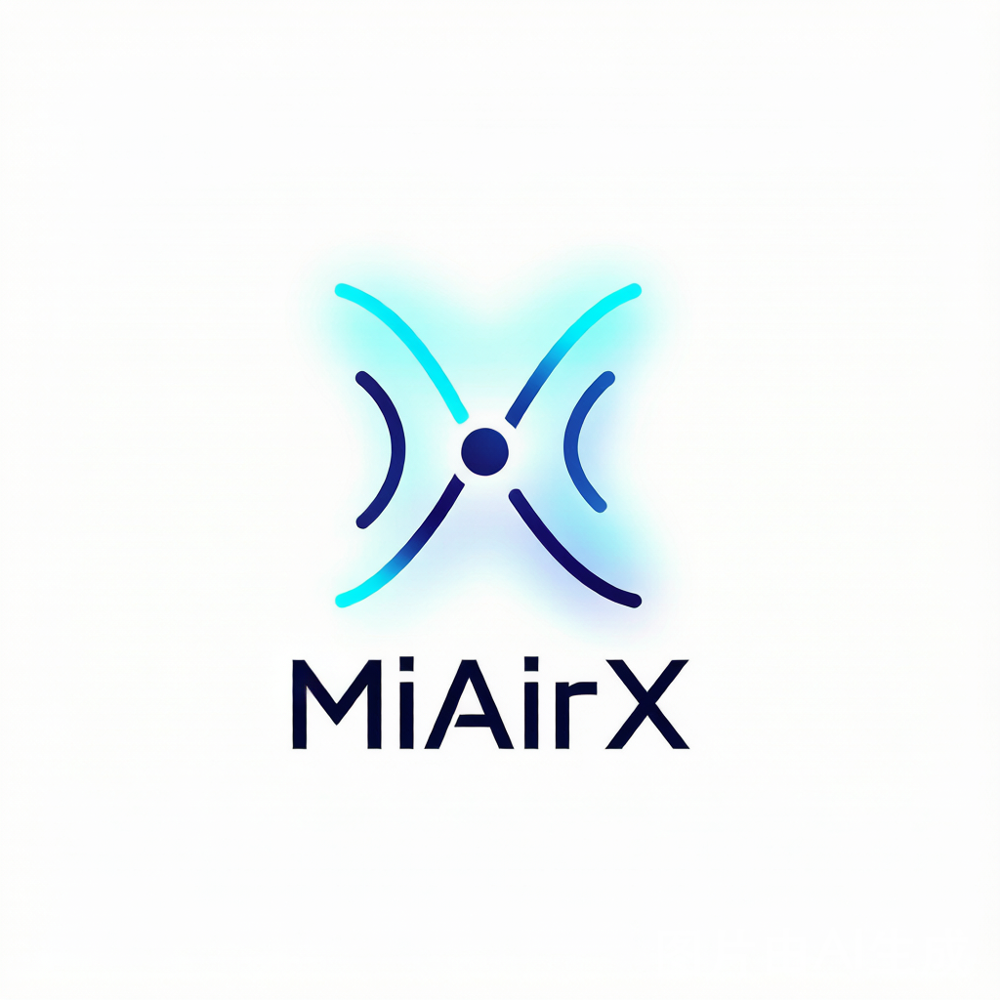

<p align="center">
  
</p>

<h1 align="center">MiAirX</h1>

<p align="center">
  <strong>把小米音箱变成局域网里的 DLNA / AirPlay 音频接收器</strong><br>
  QQ 音乐、网易云音乐和支持投放的客户端，可以直接把声音交给小爱音箱。
</p>

<p align="center">
  
  
  
  
</p>

<p align="center">
  <a href="#快速开始">快速开始</a> ·
  <a href="#管理台">管理台</a> ·
  <a href="docs/DOCKER.md">Docker</a> ·
  <a href="docs/FIREWALL.md">防火墙</a> ·
  <a href="docs/CONFIGURATION.md">配置</a> ·
  <a href="docs/ARCHITECTURE.md">架构</a> ·
  <a href="docs/DEVELOPMENT.md">开发</a>
</p>

---

## 它解决什么问题

小米音箱使用小米自己的 MiNA 接口，而大多数音乐客户端使用 DLNA/UPnP 或 AirPlay。MiAirX 在局域网里同时扮演接收器、协议翻译器和媒体中转站：

```text
音乐 App ── DLNA / AirPlay ──▶ MiAirX ── MiNA API ──▶ 小米音箱
```

它不会修改音箱固件，也不需要在手机或音箱上安装插件。

### 当前能力

- 为每台已选音箱发布独立的 DLNA 渲染器
- 支持播放、暂停、停止、音量、进度查询和 Seek
- 支持大媒体文件流式代理，避免整文件常驻内存
- 支持不兼容格式的 FFmpeg 转换与 Seek 回退
- 提供 AirPlay 1 / RAOP 接收服务
- 支持多音箱、账号密码、Cookie 或小米账号扫码登录
- 自动发现账号下的智能音箱并支持一键选择
- 配置保存后按影响范围热重载服务
- 提供可选的管理台密码保护
- 提供实时日志、基础脱敏诊断包与版本检测
- 提供 React 管理台，支持桌面与移动端
- 支持 Windows、macOS、Linux；Docker 推荐 Linux 主机网络

> AirPlay 的实际兼容性会受发送端版本、网络和音频格式影响；DLNA 是目前更稳定的投放路径。

## 快速开始

### 1. 安装

需要 Python 3.12 或更高版本。

#### 从 Release 安装

从 [GitHub Releases](https://github.com/PDSB001/MiAirX/releases) 下载最新 `.whl`：

```bash
python -m pip install ./miairx-x.y.z-py3-none-any.whl
miairx
```

Windows 也可以使用 Python Launcher：

```powershell
py -3 -m pip install .\miairx-x.y.z-py3-none-any.whl
miairx
```

#### 从源码运行

```bash
git clone https://github.com/PDSB001/MiAirX.git
cd MiAirX
python -m pip install -e .
miairx
```

仓库内的 `python start.py` 和 Windows `start.bat` 也可作为便捷启动入口。

### 2. 完成首次配置

MiAirX 可以在没有账号和音箱的情况下先启动管理台：

1. 打开 `http://127.0.0.1:8300`
2. 在「系统设置」选择扫码、账号密码或 Cookie 登录
3. 进入「设备管理」，自动发现并选择音箱
4. 保存配置；除管理端口外，相关服务会自动热重载

管理台不会回显已保存的密码和 Cookie。配置默认保存在 `conf/config.json`，不要把该文件提交到 Git。

### 3. 开始投放

- QQ 音乐：播放页 → 投屏 → 选择对应的 `XiaoAI` 设备
- 网易云音乐：播放页 → 投屏/连接设备 → 选择对应音箱
- iOS/macOS：在 AirPlay 音频设备列表中选择对应音箱
- 管理台：在「播放控制」中直接输入音频 URL

手机、运行 MiAirX 的主机和音箱必须处在同一局域网，且客户端之间不能被 AP 隔离。

## 管理台

默认地址：`http://主机局域网IP:8300`

| 页面 | 能力 |
|---|---|
| 播放控制 | 查看渲染器状态、URL 投放、暂停、停止、音量和播放进度 |
| 设备管理 | 从小米云设备中选择一个或多个音箱 |
| 系统设置 | 登录凭据、广播地址、端口、恢复、音量、后台安全和版本检测 |
| 日志与诊断 | 查看实时日志并下载基础脱敏的诊断包 |

新版管理台由 React、TypeScript、Vite 和 TanStack Query 构建。生产环境中只部署编译后的静态文件，不需要 Node.js。

旧版单文件管理页仍保留在 `http://主机IP:8300/legacy`，可在新版静态资源异常时用于恢复配置。

管理台可在「系统设置 → 后台安全」启用密码保护。即使开启认证，也不建议把 8300 端口直接暴露到公网；远程访问请优先使用可信 VPN 或反向代理的 HTTPS 与访问控制。

后台登录按直接连接的来源地址限制为 5 次失败/5 分钟，超过后返回 `429`；登录状态最多保留 24 小时，修改后台密码会立即注销全部旧会话。反向代理部署默认不会信任客户端提交的 `X-Forwarded-For`，因此还应在代理层配置独立的限流。`conf/config.json` 与 `conf/.mi.token` 都属于敏感凭据文件；Unix/Linux 下 MiAirX 会尝试使用 `0600` 文件权限，Windows/NAS 用户仍需检查挂载目录 ACL。

## Docker

DLNA SSDP 和 AirPlay mDNS 都依赖局域网组播。Docker 推荐仅在 Linux 上使用 `host` 网络：

```bash
mkdir -p conf
docker run -d \
  --name miairx \
  --network host \
  --restart unless-stopped \
  -e MI_USER='你的小米账号' \
  -e MI_PASS='你的小米密码' \
  -v "$(pwd)/conf:/app/conf" \
  jxydk/miairx:1.6.0
```

然后访问 `http://Linux主机局域网IP:8300`。

Windows/macOS 的 Docker Desktop 运行在虚拟机网络中，`network_mode: host` 通常无法让 SSDP/mDNS 正常进入物理局域网，因此更推荐直接运行 wheel。

完整说明、Compose 用法和排障步骤见 [Docker 指南](docs/DOCKER.md)。

## 配置

配置优先级为：

```text
命令行参数 > 环境变量 > conf/config.json > 默认值
```

常用环境变量：

| 环境变量 | 对应配置 | 说明 |
|---|---|---|
| `MI_USER` | `account` | 小米账号 |
| `MI_PASS` | `password` | 小米密码 |
| `MI_DID` | `mi_did` | 一个或多个 DID，逗号分隔 |
| `MIAIR_HOSTNAME` | `hostname` | 其他设备可访问的主机 IPv4 地址 |
| `MIAIR_DLNA_PORT` | `dlna_port` | DLNA HTTP 端口，默认 8200 |
| `MIAIR_WEB_PORT` | `web_port` | 管理台端口，默认 8300 |
| `MIAIR_WEB_PASSWORD` | `web_password` | 可选的管理台访问密码 |
| `MIAIR_AIRPLAY_PORT_START` | `airplay_port_start` | AirPlay TCP 起始端口，默认 7000 |
| `MIAIR_VERBOSE` | `verbose` | `true/1/yes` 开启详细日志 |

全部字段和安全说明见 [配置参考](docs/CONFIGURATION.md)。

## 网络与端口

| 用途 | 默认端口/协议 | 说明 |
|---|---|---|
| SSDP | UDP 1900 组播 | DLNA 设备发现 |
| DLNA HTTP / 媒体代理 | TCP 8200 | 设备描述、控制和媒体传输 |
| Web 管理台 | TCP 8300 | 管理页面和 JSON API |
| AirPlay mDNS | UDP 5353 | AirPlay 服务发现 |
| AirPlay RTSP/音频 | TCP 7000 起 | 每台启用音箱固定占用两个连续端口 |

默认情况下，第一台音箱使用 TCP 7000/7001，第二台使用 7002/7003。Docker/NAS 可以统一放行 TCP 7000–7099，覆盖最多 50 台音箱；修改起始端口时应同步平移防火墙规则。

只应对可信局域网放行：TCP 8200、TCP 8300、UDP 1900、UDP 5353 和 AirPlay TCP 端口段。SSDP 的组播方向、`docker pull` 手动部署、UFW、firewalld、Windows 和 NAS 规则见 [防火墙与局域网发现](docs/FIREWALL.md)。

## 常见问题

<details>
<summary><strong>投屏列表里没有 MiAirX 音箱</strong></summary>

- 确认手机、主机和音箱处于同一子网
- 关闭 VPN、代理、访客网络和 AP 隔离后重试
- 检查 `hostname` 是否为主机真实的局域网 IPv4，而不是 `127.0.0.1`
- 按 [防火墙指南](docs/FIREWALL.md) 放行 SSDP 与对应业务端口
- Docker 必须使用 Linux `--network host`
</details>

<details>
<summary><strong>能看到设备，但播放没有声音</strong></summary>

- 在管理台确认选择的是正确 DID
- 检查账号或 Cookie 是否仍然有效
- 确认音箱本身在线且音量不为零
- 打开详细日志，查看 MiNA 请求和媒体代理错误
- 特殊格式可安装 FFmpeg，Docker 镜像已内置 FFmpeg
</details>

<details>
<summary><strong>大文件播放失败或很久才出声</strong></summary>

当前版本会对已知大小超过 32 MiB 的媒体使用流式代理。若仍失败，检查源站是否允许服务器访问、是否正确响应 Range/Content-Length，以及音箱是否能访问配置中的 `hostname:8200`。
</details>

<details>
<summary><strong>启动时报端口只能使用一次</strong></summary>

已有 MiAirX 或其他程序占用了 8200/8300。停止旧进程，或通过配置/命令行更换端口。不要同时启动 `start.py`、`miairx` 和 Docker 实例。
</details>

<details>
<summary><strong>配置保存后没有立即生效</strong></summary>

账号、音箱、广播地址、DLNA/AirPlay 端口、音量和运行策略会在保存后自动生效。只有管理端口 `web_port` 变更仍需重启 MiAirX，因为当前请求所在的 Web 服务无法在响应过程中重新绑定端口；管理台会明确提示。
</details>

## 开发与文档

- [文档导航](docs/README.md)
- [配置参考](docs/CONFIGURATION.md)
- [Docker 指南](docs/DOCKER.md)
- [架构说明](docs/ARCHITECTURE.md)
- [开发指南](docs/DEVELOPMENT.md)
- [通俗原理](docs/SIMPLE.md)
- [项目交接](docs/PROJECT_HANDOVER.md)

最小开发检查：

```bash
python -m pip install -e ".[dev]"
pytest tests -q

cd frontend
pnpm install --frozen-lockfile
pnpm check
pnpm test:e2e
```

## 致谢

核心 DLNA 状态机及 MiNA API 桥接思路源自 [MiAir](https://github.com/KiriChen-Wind/MiAir)，感谢原作者和相关开源项目贡献者。

## 许可证

[MIT](LICENSE) © 2025 KiriChen-Wind · 2026 MiAirX Contributors
