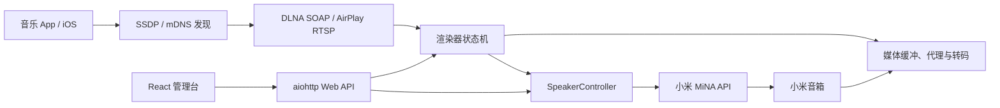
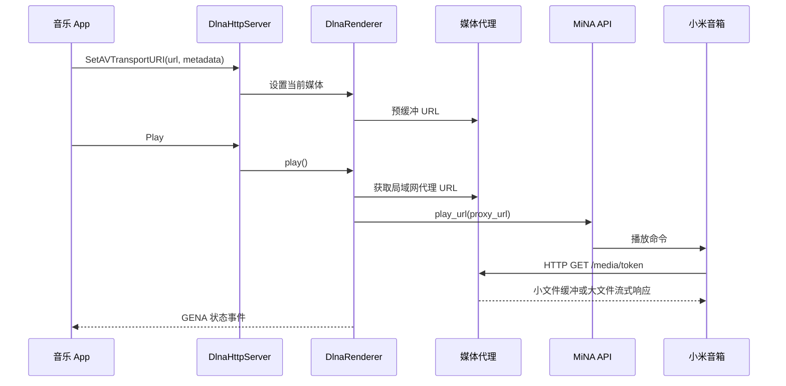

# MiAirX 架构说明

本文描述当前代码的组件边界和关键数据流。协议入门可以先读 [通俗原理](SIMPLE.md)，部署配置见 [配置参考](CONFIGURATION.md)。

## 目标与边界

MiAirX 的核心目标是让只理解 MiNA API 的小米音箱，表现为局域网中的标准音频接收器。

MiAirX 负责：

- 发布 DLNA/UPnP 与 AirPlay 1/RAOP 服务
- 把标准播放控制翻译为小米云控制请求
- 为音箱提供可访问的媒体 URL
- 维护比云端轮询更稳定的播放状态和进度
- 提供配置与诊断管理台

MiAirX 不负责：

- 解密音乐平台 DRM
- 绕过媒体源的账号、地域或签名限制
- 修改音箱固件
- 在多个音箱之间做精确采样级同步

## 总体结构



## 进程内组件

### `Application`

`src/miairx/app.py` 是生命周期编排器：

- 创建共享的 IPv4 `aiohttp.ClientSession`
- 初始化认证和音箱控制器
- 启动 DLNA HTTP、SSDP、AirPlay 和管理台
- 维护 DID 与渲染器 UDN 的映射
- 周期轮询音箱状态并处理自动恢复
- 按依赖顺序关闭异步资源

网络服务绑定失败时，`start()` 抛出异常，CLI 的 `finally` 路径负责触发统一清理，避免遗留 `ClientSession`。

### `AuthManager` 与 `SpeakerManager`

认证层支持账号密码和 `userId`/`passToken` Cookie。`SpeakerManager` 根据配置中的 DID 创建 `SpeakerController`，后者封装播放、暂停、停止、音量和状态查询。

登录失败带有重试和连续失败计数。启用 `auto_restart` 时，达到阈值会请求进程退出；真正的重启由 Docker、systemd 或其他监督器完成。

### DLNA 协议层

`src/miairx/protocols/dlna/` 包含：

| 组件 | 职责 |
|---|---|
| `SsdpServer` | 监听 M-SEARCH、主动通知并发布每个渲染器 |
| `DlnaHttpServer` | 设备描述、SCPD、SOAP、GENA 和媒体端点 |
| `SoapHandler` | 将 UPnP action 分发给渲染器 |
| `DlnaRenderer` | AVTransport/RenderingControl 状态机 |
| `EventManager` | 订阅、续订、取消和 LastChange 通知 |
| `templates.py` | 设备与服务 XML 模板 |

一台音箱对应一个 UDN、一个渲染器和一组事件订阅。

### AirPlay 协议层

`src/miairx/protocols/airplay/` 为每台音箱创建：

- 固定可预测端口的 RAOP/RTSP 服务
- IPv4 mDNS 广播
- 固定可预测端口的音频接收与局域网 HTTP 输出
- 播放、停止和音量回调

AirPlay 与 DLNA 共用 `SpeakerController`，但各自维护协议会话。

### Web 管理层

后端 `src/miairx/web/app.py` 提供 JSON API 和静态资源：

- `/`：React 管理台
- `/static/app/`：Vite 生产资源
- `/legacy`：旧单文件管理页
- `/api/*`：配置、设备、控制和状态接口

前端源码位于 `frontend/`：

- React 负责界面与交互
- TanStack Query 管理轮询、缓存和 mutation
- TypeScript 描述 API 契约
- CSS 变量和 Tailwind 基础层构建设计系统
- Vitest/Testing Library 做组件测试
- Playwright 做桌面/移动端冒烟测试

Vite 将构建产物直接写入 Python 包目录，因此运行时不需要 Node.js。

## DLNA 播放数据流



## 媒体策略

### 小媒体

`MediaBuffer` 在内存中异步下载媒体。渲染器设置 URI 时会提前开始缓冲，播放时复用同一 buffer 和 token。

小文件路径支持：

- Range 请求
- 内容类型透传
- FFmpeg Seek
- 格式感知的 Seek 回退
- buffer TTL 回收

### 大媒体和未知长度媒体

已知大小超过 32 MiB，或下载中超过内存策略的媒体，会标记为流式模式。媒体请求到达时，服务器向源站重新发起请求并逐块转发，避免：

- 播放前等待整文件下载
- 大文件造成过高内存峰值
- 对 `bytearray` 做完整复制

流式路径会透传关键 Range 请求头和响应头。它依赖上游继续允许访问原始 URL；短时签名失效会导致 502。

## 播放状态模型

小米云返回的状态可能延迟或短暂错误，不能直接作为 DLNA 状态。`DlnaRenderer` 因此维护本地影子状态：

```text
NO_MEDIA_PRESENT → STOPPED → TRANSITIONING → PLAYING
                                      ↘ PAUSED_PLAYBACK
```

位置由两部分组成：

```text
当前进度 = 已累计秒数 + 本次 PLAYING 开始后的墙钟时间
```

关键保护：

- 媒体 generation 防止旧的自动切歌任务停止新媒体
- 播放宽限期避免刚开始播放就被迟到的 STOPPED 覆盖
- 用户主动 pause/stop 与云端异常停止分开处理
- 暂停时固化累计位置，恢复时重新开始计时
- 有 duration 时才执行临近结尾的自动下一曲逻辑

## 发现与 Docker

DLNA SSDP 使用 IPv4 组播，AirPlay Zeroconf 也显式限制为 IPv4，避免没有 IPv6 路由的 Docker 主机向 `::1:5353` 发送失败。

Docker 必须使用 Linux host 网络，原因不是 HTTP 端口映射，而是：

- 组播需要进入物理局域网
- SSDP 响应地址必须对手机可达
- 音箱需要回连媒体代理
- AirPlay 每台音箱使用从 `airplay_port_start` 起分配的两个连续 TCP 端口

详见 [Docker 指南](DOCKER.md)。

## 关闭顺序

应用关闭时的主要顺序是：

1. 取消周期任务和恢复任务
2. 停止 AirPlay 服务
3. 停止 SSDP 和 DLNA HTTP
4. 停止 Web runner
5. 关闭共享 HTTP session 和 Zeroconf

新增后台任务时必须注册取消/等待逻辑，避免 Windows 上出现端口未释放或 aiohttp session 泄漏。

## 设计约束

- `hostname` 是对外广播地址，不是简单的 bind address。
- 每台音箱的 UDN 必须稳定，客户端会缓存它。
- SOAP/XML 的 namespace 和响应格式属于兼容性边界。
- 不应把不可靠的云端状态直接覆盖本地播放意图。
- 媒体 URL 必须能被音箱访问，不能使用 localhost。
- Web 配置保存不等于热重载，服务拓扑变化需要重启。
